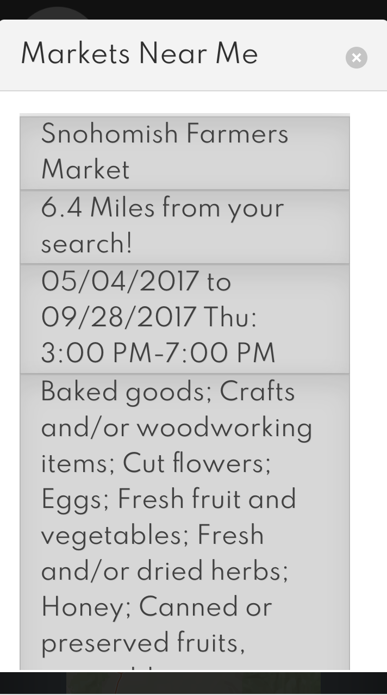
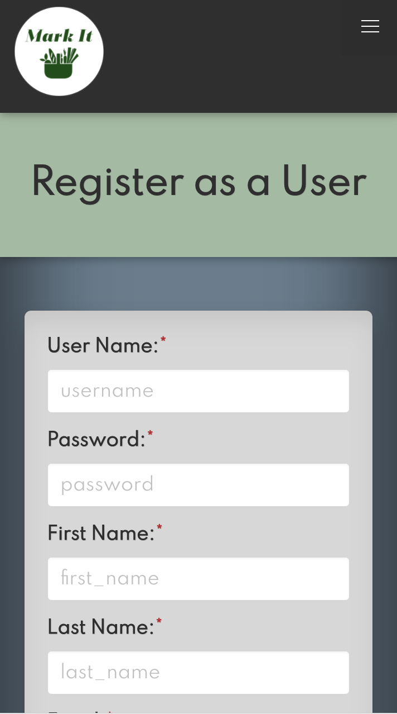
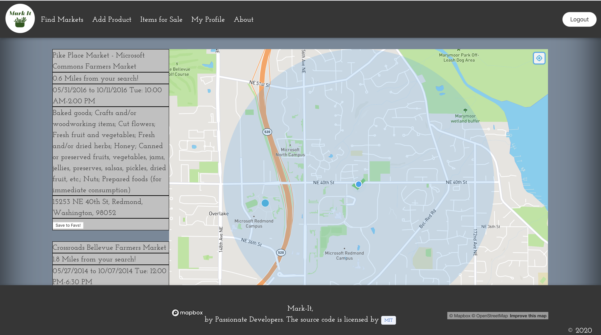
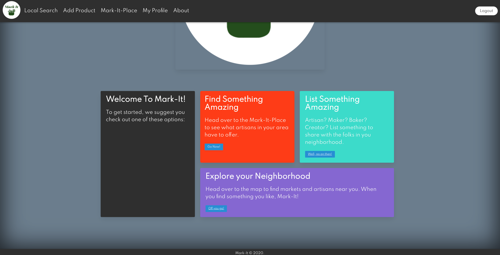
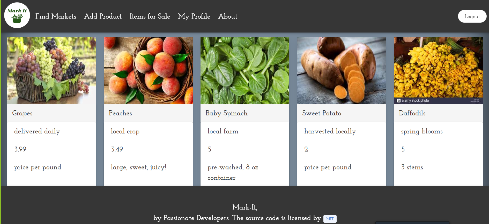

# [Mark-It](https://awesome-mark-it.herokuapp.com/)

## Your local farmers market

###  Mark It is a full stack application built with React that allows user to create, edit and delete a posting of a product.

## Table of contents
* [General info](#general-info) 
* [Screenshots](#screenshots) 
* [Installation](#installation) 
* [Usage](#usage)
* [Credits](#credits)
* [Features](#features) 
* [Status](#status) 
* [License](#license) 
* [Contributers](#contributers)


## General Info

> This application gives user the ability to find farmers market events when searching by zip code, to post products for sell, to favorite vendors and markets. Your posted item will be pinned to the map and will be shown to the users that have marked you.


## Screenshots

mobile screen size responsive

  

<hr>
Once landing at the splash page , a video showing with introduction about the page


On Find Market tab, if you are not logged in , you can find farmers market events searched by zip code, If you log in , you can post an item and it will be pinned to the map.


The user profile layout with shortcuts to the map, add product and all items for sale.


The view all products page



## Installation
To install:
* [Visual Code](https://code.visualstudio.com/docs/setup/setup-overview)
* [NodeJS](https://nodejs.org/en/download/)
* [MySql](https://dev.mysql.com/downloads/installer/)
* [MySqlworkbench](https://dev.mysql.com/downloads/workbench/)


In order to install, first download the files. Then you would open terminal and type ```npm install``` . This will install all the npm packages listed under the dependencies in the package.json. Then you will type the command ``` npm start```. This will start the react app at the port 3000 in the browser. Finally you will type ```localhost:3000``` in the browser window and use the application. 


## Usage 

To use this application, you can [click here](https://awesome-mark-it.herokuapp.com/).

Upon clicking on the link above, you can create a user and password in the app and from there you can be directed to posting items for sell or searching markets by zipcode.


## Credits

Built with [Bulma](https://bulma.io/)

Fonts from [Google Fonts](https://developers.google.com/fonts)

Icons from [flat icon](https://www.flaticon.com/)

Logo from [Tailorbrands](https://www.tailorbrands.com/)

deploy with [heroku](https://dashboard.heroku.com/)

animation [animista](https://animista.net/)

video edits [imovie](https://www.apple.com/imovie/)

#### npm packages used:

 * [axios](https://www.npmjs.com/package/axios)
 * [bulma](https://www.npmjs.com/package/bulma)
 * [mapbox-gl](https://www.npmjs.com/package/mapbox-gl)
 * [bcrypt](https://www.npmjs.com/package/bcrypt)
 * [dotenv](https://www.npmjs.com/package/dotenv)
 * [express](https://www.npmjs.com/package/express)
 * [sequelize](https://www.npmjs.com/package/sequelize)
 * [uniqid](https://www.npmjs.com/package/uniqid)
 * [Node MySQL 2](https://www.npmjs.com/package/mysql2)
 * [MySQL](https://www.npmjs.com/package/mysql)
 * [connect-session-sequelize](https://www.npmjs.com/package/connect-session-sequelize)
 * [express-session](https://www.npmjs.com/package/express-session)
 * [foundation-sites](https://www.npmjs.com/package/foundation-sites)
 * [mysql2](https://www.npmjs.com/package/mysql2)
 * [nodemailer](https://www.npmjs.com/package/nodemailer)
 * [session](https://www.npmjs.com/package/node-session)
 * [react-moment](https://www.npmjs.com/package/react-moment)
 * [moment](https://www.npmjs.com/package/moment)
 * [react-calendar](https://www.npmjs.com/package/react-calendar)
 * [bulma-toast](https://www.npmjs.com/package/bulma-toast)

#### Other Technologies used:
* For photo upload [cloudinary](https://cloudinary.com/)
* For data manipulation/array methods [Lodash](https://lodash.com/)


## Features
List of features:
* Feature 1: Easy to navigate design.
* Feature 2: Ability to create, update, delete product postings.
* Feature 3: Map to show where on the map an item is selling.
* Feature 4: Ability to create a user and password.
* Feature 5: Ability to post an item for sale which will be pinned to map.
* Feature 6: Showing market events on calendar.
* Feature 7: Toast alerts on the page.
* Feature 8: form validation.


To-do list:
* a. Ability to send email to the users that follow a vender.
* b. pop up functionality, real time notification for vendors
* c. Chat functionality within the app
* d. To send a payment verification message to the buyer
* e. Having a budget graph
* f. allowing user to rate a vender or write a review
* g. add to cart
* h. ability to add review on items from a vendor


## Status
Project is:  _in progress_

#### Inspiration
The  Covid 19 pandemic has caused the majority of the population to practice social distancing. This application can help local producers to sell their products to local people.


## License

MIT license 
Copyright © 2020 Zahra Ali Aghazadeh, Diana Stebbins, John Huntsperger, Zac Stowell


## Contributors

Feel free to contact us via linkedIn for any feedbacks, questions or collaborations! 


 <br>
Diana Stebbins : Back End Developer/ Git Master
[Github](https://github.com/dianastebbins) ,
[LinkedIn](https://www.linkedin.com/in/diana-stebbins-b618b034/)


<br>
John Huntsperger : Front End Developer/ Designer
[Github](https://github.com/Huelsdonk) ,
[linkedIn](https://www.linkedin.com/in/john-huntsperger-4854b01a1/)


 <br>
Zac Stowell: Back End Developer
[Github](https://github.com/the-medium-place) ,
[LinkedIn](https://www.linkedin.com/in/zachary-stowell)


 <br>
Yalda Ali Aghazadeh : Project Manager / Front End Developer/ Designer
[Github](https://github.com/zahraaliaghazadeh) ,
[LinkedIn](www.linkedin.com/in/yalda-aghazade)


